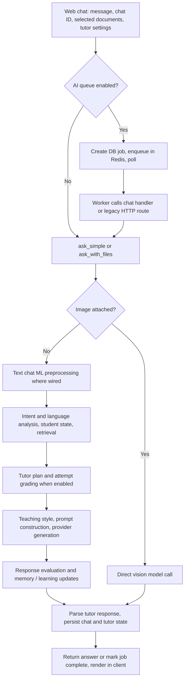

# AI workflow review — 5 September 2026

Assessment: the architecture has useful depth, but the integration is not yet reliable enough to treat its answers, mastery scores, and job completion states as authoritative. Fix the existing workflow before adding more agents or changing models.

Scope: traced the web chat entry point, direct and queued chat execution, tutor graph, retrieval, attachments, provider abstraction, evaluation, learning-state persistence, and usage checks; sampled quiz/flashcard/note generation. This is not an exhaustive audit of every media and generation endpoint. No live provider calls, production requests, or existing database mutations were performed. No application code was changed.

## How requests actually flow

Relevant entry points: [AIChat.js:1592](src/pages/AIChat.js#L1592), [aiJobService.js:16](src/services/aiJobService.js#L16), [chat.py:1357](backend/routes/chat.py#L1357), [worker.py:120](backend/worker.py#L120), [graph.py:21](backend/tutor/graph.py#L21).

The main text tutor graph executes intent detection → message analysis → student state → retrieval → lesson planning → attempt grading → plan progress → teaching-style selection → generation → evaluation → persistence. Images bypass most of this graph. Text attachments use the graph but skip the shared route-level ML preprocessing used by ordinary text chat.

## Findings requiring fixes

### 1. High — provider/graph failures become successful answers

Evidence: [nodes.py:2180](backend/tutor/nodes.py#L2180), [graph.py:91](backend/tutor/graph.py#L91), [chat.py:1439](backend/routes/chat.py#L1439), [worker.py:195](backend/worker.py#L195).

Generation catches provider failures and returns a normal-looking response plus an `error`. Graph execution continues into evaluation and persistence. `TutorGraph.invoke` does not include the state's `error` in its normal returned dictionary. Routes read `response` without requiring a successful outcome and can save the apology as an assistant answer and award chat points. Workers then mark it completed and may cache the error text.

Separately, `ask_simple`'s quota exception branch returns the hardcoded load-test answer for ordinary requests. Its generic exception branch returns an HTTP-200 error-shaped answer. The web client checks for a nonempty answer, not `query_type == error`.

Confirmed with an isolated graph wrapper probe: a node result containing `error='provider timeout'` lost that error in the returned result.

Fix: introduce one explicit success/error contract, typed retryable failures, and graph error branches. Skip answer caching, reward updates, and successful-message persistence on failure. Preserve provider-limit errors as 429 and temporary failures as retryable errors. Keep load-test responses behind an explicit test-only condition.

### 2. High — a hardcoded grading shortcut marks incorrect statements correct

Evidence: [nodes.py:1877](backend/tutor/nodes.py#L1877), [nodes.py:1965](backend/tutor/nodes.py#L1965).

The integration-specific shortcut accepts an answer whenever the prior question mentions integrating `3x^2` and the answer contains an `x^3` match. It does not check negation or the rest of the expression. It also hardcodes the next action as integrating the constant 4, regardless of the actual remaining problem.

Reproduced: the answer `It is not x^3` was graded `correct` with confidence `0.99`. That verdict can advance the lesson and affect persisted learning metrics.

Fix: remove this substring-based correctness rule. If deterministic math grading is used, validate supported full expressions/equivalence against the current task; defer unsupported input to a structured evaluator. Add negative, negated, extra-term, and different-next-step cases.

### 3. High — mastery treats questions as incorrect answers

Evidence: [ml_pipeline.py:345](backend/services/ml_pipeline.py#L345), [chat.py:1050](backend/routes/chat.py#L1050), [nodes.py:2232](backend/tutor/nodes.py#L2232).

The BKT update maps conversational intent to a correctness branch. `question`, `exploration`, and `off_topic` all fall into the incorrect-observation branch when concepts are detected. A confidence phrase takes the positive branch without verified correctness. This happens before the tutor grades an actual attempt. A separate language-signal path also adjusts weakness counts from conversational signals.

An isolated execution starting at mastery 0.8 with p_slip=0.1, p_guess=0.2, p_learn=0.09 lowered mastery to approximately 0.393 for intent `question`. The same method computes a mastery delta internally but returns literal `0.0` as its delta field.

Fix: distinguish observed performance, self-report, affect, and ordinary questions. Update correctness-based mastery from scored attempts, with softer signals maintained separately. Return the computed delta. Establish one documented meaning/source of truth for mastery: the lesson plan, chat correct-attempt ratio, and BKT currently represent different quantities under similar names.

### 4. High — selected-document grounding depends incorrectly on the curriculum toggle

Evidence: [graph.py:73](backend/tutor/graph.py#L73), [nodes.py:1201](backend/tutor/nodes.py#L1201).

The graph derives `context_only` as `(context_only or selected_doc_ids) and use_hs_context`. Consequently, turning off HS curriculum mode also disables the strict selected-document rule, even though retrieval still queries the explicitly selected private documents. The no-match guard similarly depends on the HS flag.

Reproduced: selected private documents plus explicit `context_only=True` produced `context_only=False` when HS was disabled.

Fix: separate curriculum inclusion from source-only grounding. Explicit document selection must retain its defined grounding behavior regardless of the HS setting. Test HS on/off × selected/no-selected docs × successful/empty/failed retrieval.

### 5. High, conditional — global semantic cache can reuse personalized answers across users

Evidence: [ai_jobs.py:47](backend/routes/ai_jobs.py#L47), [worker.py:125](backend/worker.py#L125), [ai_semantic_cache.py:77](backend/services/ai_semantic_cache.py#L77).

The client may request `cache_scope='global'`. With no explicit session, selected docs, or tutor mode, the worker permits semantic caching. However, the normal chat path still fetches the user's profile, memories, and potentially private documents. Global metadata omits user ID, so another user making a similar globally scoped request can match the personalized response. The user-scoped cache also does not encode document/memory revisions or the HS toggle, so even same-user answers can be stale or mode-inappropriate.

Confirmed that different users' global cache metadata matches. An end-to-end disclosure was not attempted. This exposure requires semantic caching to be enabled; its code default is disabled, and the main chat UI normally supplies a session, disabling this cache path.

Fix: disallow client-selected global caching for personalized chat. Only use shared caches for explicitly public, nonpersonalized generation with a server-owned key/schema. Include relevant context and prompt/model versions in private cache identity, and never cache failed results.

### 6. High — queue delivery, timeout, and retry behavior are inconsistent

Evidence: [ai_job_queue.py:147](backend/services/ai_job_queue.py#L147), [worker.py:358](backend/worker.py#L358), [aiJobService.js:5](src/services/aiJobService.js#L5), [ai_jobs.py:121](backend/routes/ai_jobs.py#L121).

The queue removes jobs before execution without acknowledgement/lease recovery. A process crash can orphan a queued/running job. Creation also commits the database job before queue insertion, without a durable outbox to reconcile a process death between those operations. Worker claiming is not atomic against duplicate execution.

The frontend normally stops polling after 180 seconds, while file jobs default to 420 seconds and media jobs to 600 seconds, before considering queue wait and retry backoff. The UI can report failure while generation still runs and incurs cost. Polling has no abort signal, durable resumption, or retry handling for a transient failed poll.

Fix: acknowledged delivery, atomic job claiming, idempotency keys, stale-job recovery, and a durable job lifecycle visible to the client. Show delayed/running status instead of equating a polling deadline with generation failure. Add reconnect/resume and worker-kill tests.

### 7. Medium — image and document conversations have different capabilities

Evidence: [chat.py:1647](backend/routes/chat.py#L1647), [chat.py:1716](backend/routes/chat.py#L1716), [chat.py:1762](backend/routes/chat.py#L1762), [chat.py:1824](backend/routes/chat.py#L1824).

The image branch sends the enriched current question and images directly to `generate_with_images`. Although chat history and tutor state are loaded, they are not passed to that call. Selected context documents, graph planning, and attempt grading are not part of this vision path. The response is subsequently parsed as tutor output, but parsing cannot supply the missing tutoring decisions.

Text attachments are truncated to the first 12,000 characters per file. This path saves storage metadata but does not index the attachment into persistent retrieval context. A later text-only follow-up sees prior question/answer text, not the original complete attachment. Questions about later pages can therefore lack the relevant evidence.

Fix: normalize attachments into persistent conversation sources and use one tutoring orchestration layer with multimodal capability. Retrieve query-relevant pages, preserve provenance, and tell users about incomplete extraction. Test follow-up questions, late-document evidence, and image-plus-selected-document requests.

### 8. Medium — retrieval and citations do not establish answer support

Evidence: [context_store.py:382](backend/services/context_store.py#L382), [nodes.py:269](backend/tutor/nodes.py#L269), [nodes.py:1775](backend/tutor/nodes.py#L1775), [AIChat.js:1664](src/pages/AIChat.js#L1664).

Retrieval ranks nearest chunks but applies no minimum relevance/answerability threshold in the inspected search path. A populated index can return unrelated chunks, preventing the strict-context no-match behavior from activating. Citation postprocessing maps numeric markers to metadata; it does not check that a source supports a claim, ignores invalid markers, and skips all correction if the response already contains `sources:`.

It also appends Markdown to raw tutor JSON, relying on later lenient parsing. The frontend's new-message mapping does not retain the structured `sources` array returned by the backend. Separately, the hidden lesson planner runs after retrieval but its prompt does not include the retrieved chunks; it can create grading expectations detached from the selected course evidence.

Fix: evaluate retrieval/answerability on a fixed test set, require valid structured citation IDs, format citations after parsing, and retain source metadata in the client. Ground lesson plans and grading expectations in the same source snapshot used for teaching. A reference list is not a factuality check.

### 9. Medium — the response evaluator adds latency without validating correctness

Evidence: [graph.py:50](backend/tutor/graph.py#L50), [nodes.py:2199](backend/tutor/nodes.py#L2199), [evaluator.py:13](backend/tutor/evaluator.py#L13), [intent_engine.py:236](backend/services/intent_engine.py#L236).

An ordinary educational text turn can require generation plus a separate evaluation call. Tutor turns commonly add planning or grading, and repairs/fallbacks add further serial calls. The response evaluator runs before the answer is returned, but asks about pedagogical outcomes, not factual support. It does not receive retrieved source evidence, and its failure defaults to a no-op. Its strategy/mastery booleans are not a response-quality gate.

The returned `ai_confidence` is a heuristic using intent entropy, affect-related inputs, and hedging density. It is not a calibrated probability of factual correctness. No real latency benchmark or answer-quality evaluation was performed in this review.

Fix: define which checks must block delivery. Move optional memory distillation/analytics out of the critical response path. Keep grading where required, measure calls/cost and p50/p95 by mode, and use a request-wide deadline. Rename or remove misleading correctness confidence; report evidence coverage separately. Consider real streaming after response/state contracts are stable.

### 10. Medium — user budgets are checked, not reserved

Evidence: [token_limit.py:110](backend/middleware/token_limit.py#L110), [token_limits.py:129](backend/services/token_limits.py#L129), [ai_utils.py:607](backend/services/ai_utils.py#L607).

Usage enforcement reads already-recorded usage before a request. It does not reserve an allowance for the planned graph calls, so concurrent requests can all pass against the same remaining balance. Usage logging failures are caught and logged, leaving successfully generated work potentially uncounted. Provider-key reservations address a different constraint and do not solve per-user accounting.

Fix: reserve an estimated bounded user budget atomically, reconcile actual provider usage across generation/grading/repair calls, and release unused reservations on failure. Persist usage reliably with request/job IDs and provider provenance. Define permitted single-request overage explicitly.

## What is worth preserving

- A shared provider abstraction and existing fallback/key-pool support.
- Separation of tutor planning, attempt grading, and answer generation.
- User-filtered vector retrieval and explicit document filtering in the inspected storage path.
- Chat ownership checks and persisted tutor state.
- Threadpool offloading for main tutor model calls.
- Dedicated math/JSON formatting helpers and existing tutor regression tests.
- Existing retry/dead-letter scaffolding, source metadata, and usage instrumentation.

These are useful building blocks. The main problems are inconsistent contracts, incorrect evidence interpretation, and divergence between request modes.

## Verification and recommended next work

Ran `python3 -m pytest backend/tests/test_tutor_comprehension.py backend/tests/test_tutor_prompt_priority.py -q`: **38 passed**. These are focused, partly stubbed tests, not live-model or complete ASGI integration tests.

Executed extracted repository functions with fake infrastructure to confirm:

1. Negated `x^3` answer incorrectly graded correct.
2. Graph error omitted from the normal returned result.
3. HS-off disables explicitly requested selected-document grounding.
4. Different users match global cache metadata.
5. A normal question lowers mastery 0.8 → 0.393 while returning delta 0.0.

Full provider behavior, Redis-backed end-to-end cache disclosure, crash recovery, attachment interpretation quality, and production latency remain unverified. The probes isolate code defects without using real accounts or paid API calls.

Fix order: **error contract and cache isolation → grading/mastery correctness → document-mode consistency → queue lifecycle → unified multimodal context → evidence checks and latency optimization**. Add regression coverage at each boundary. The account-isolation and entitlement defects from PROJECT_REVIEW.md remain prerequisites for safely exposing these AI paths.
